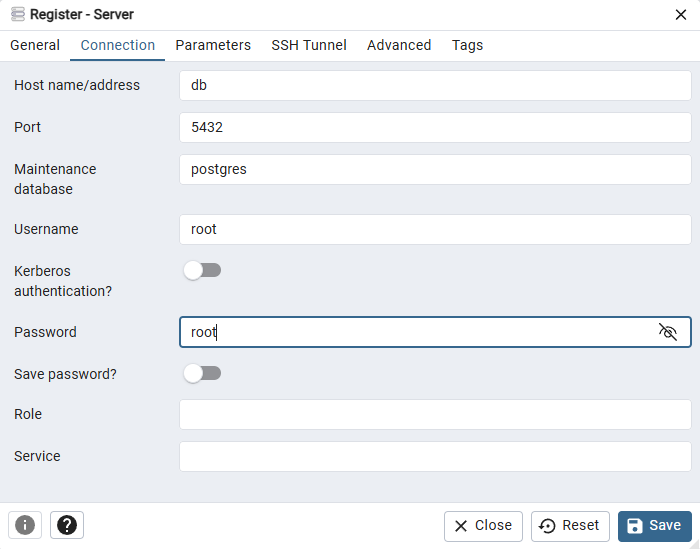

<h1 align="center">
    <strong>Containerize PostgreSQL & PgAdmin4</strong>
</h1>

### Only using PostgreSQL container.
User: root

Password: root

Database: postgres

##### Build image:

```bash
docker build -t my_postgres .
```
This will create an image named ```my_postgres``` 

##### Run image/create container:

```bash
docker run -d --name my_postgres -p 5432:5432 my_postgres
```

This will run an image that has built before (container). And the container's name is my_postgres.

##### Interact container:

```bash
docker exec -it my_postgres bash
```

Now, we have interacted with container.

Connect to our database ```postgres``` to query, etc...:
```bash
psql -h localhost -U root -d postgres
```

### Using both PostgreSQL and PgAdmin4 container.
PG_email: admin@admin.com

PG_password: admin

Run command to create containers:
```bash
docker-compose up
```

Access to [PgAdmin4 User Interface](localhost:8080)

Add new server and enter:

